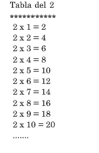

# ESTRUCTURAS BÁSICAS DE CONTROL.

- Ejercicio 1. Transforma el siguiente bucle for en un bucle while:

  ```java
  for (int i = 5; i < 15; i++) {
    System.out.println(i);
  }
  ```

- Ejercicio 2. Programa que muestre por pantalla los 5 primeros números pares.

- Ejercicio 3. Programa que muestre por pantalla del número 200 al 300.

- Ejercicio 4. Programa que muestre en pantalla la tabla de multiplicar del 1 al 10 con el formato:

  

- Ejercicio 5. Programa que muestre los números del 1 al 100 sin mostrar los múltiplos de 5.

- Ejercicio 6. Leer un número y mostrar su cuadrado, repetir el proceso hasta que se introduzca un número negativo.

- Ejercicio 7. Leer un número e indicar si es positivo o negativo. El proceso se repetirá hasta que se introduzca un 0.

- Ejercicio 8. Leer números hasta que se introduzca un 0. Para cada uno indicar si es par o impar.

- Ejercicio 9. Pedir números hasta que se teclee uno negativo, y mostrar cuántos números se han introducido.

- Ejercicio 10. Realizar un juego para adivinar un número. Para ello pedir un número N, y luego ir pidiendo números indicando “mayor” o “menor” según sea mayor o menor con respecto a N. El proceso termina cuando el usuario acierta.

- Ejercicio 11. Pedir números hasta que se teclee un 0, mostrar la suma de todos los números introducidos.

- Ejercicio 12. Pedir números hasta que se introduzca uno negativo, y calcular la media. Ejercicio 13. Pedir un número N, y mostrar todos los números del 1 al N.

- Ejercicio 14. Escribir todos los números del 100 al 0 de 7 en 7.

- Ejercicio 15. Pedir 15 números y escribir la suma total.

- Ejercicio 16. Diseñar un programa que muestre el producto de los 10 primeros números impares.

- Ejercicio 17. Pedir un número y calcular su factorial.

- Ejercicio 18. Pedir 10 números. Mostrar la media de los números positivos, la media de los números negativos y la cantidad de ceros.

- Ejercicio 19. Pedir 10 sueldos. Mostrar su suma y cuantos hay mayores de 1000€.

- Ejercicio 20. Dadas las edades y alturas de 5 alumnos, mostrar la edad y la estatura media, la cantidad de alumnos mayores de 18 años, y la cantidad de alumnos que miden más de 1.75. Ejercicio 21. Pide un número (que debe estar entre 0 y 10) y mostrar la tabla de multiplicar
de dicho número.

- Ejercicio 22. Una empresa que se dedica a la venta de desinfectantes necesita un programa para gestionar las facturas. En cada factura figura: el código del artículo, la cantidad vendida en litros y el precio por litro.

  Se pide de 5 facturas introducidas: Facturación total, cantidad en litros vendidos del artículo 1 y cuantas facturas se emitieron de más de 600 €.

- Ejercicio 23. Igual que el anterior pero suponiendo que no se introduce el precio por litro. Solo existen tres productos con precios:
  1- 0,6 €/litro, 2- 3 €/litro y 3- 1,25 €/litro.

- Ejercicio 24. Dadas 6 notas, escribir la cantidad de alumnos aprobados y suspensos.

- Ejercicio 25. Pedir un número N, introducir N sueldos, y mostrar el sueldo máximo.

- Ejercicio 26. Pedir 10 números, y mostrar al final si se ha introducido alguno negativo. 

- Ejercicio 27. Pedir 5 calificaciones de alumnos y decir al final si hay algún suspenso.

- Ejercicio 28. Pedir 5 números e indicar si alguno es múltiplo de 3.

- Ejercicio 29. Realiza un programa que pida una hora por teclado y que muestre luego buenos días, buenas tardes o buenas noches según la hora. Se utilizarán los tramos de 6 a 12, de 13 a 20 y de 21 a 5. respectivamente. Sólo se tienen en cuenta las horas, los minutos no se deben introducir por teclado.

- Ejercicio 30. Escribe un programa en que dado un número del 1 a 7 escriba el correspondiente nombre del día de la semana.

- Ejercicio 31. Escribe un programa que calcule el salario semanal de un trabajador teniendo en cuenta que las horas ordinarias (40 primeras horas de trabajo) se pagan a 12 euros la hora. A partir de la hora 41, se pagan a 16 euros la hora.

- Ejercicio 32. Realiza un programa que calcule la media de tres notas.

- Ejercicio 33. Amplía el programa anterior para que diga la nota del boletín (insuficiente, suficiente, bien, notable o sobresaliente).

- Ejercicio 34. Escribe un programa que nos diga el horóscopo a partir del día y el mes de nacimiento.

- Ejercicio 35. Realiza un minicuestionario con 4 preguntas tipo test sobre las asignaturas que se imparten en el curso. Cada pregunta acertada sumará un punto. El programa mostrará al final la calificación obtenida.

- Ejercicio 36. Calcula la nota de un trimestre de la asignatura Programación. El programa pedirá las dos notas que ha sacado el alumno en los dos primeros controles. Si la media de los dos controles da un número mayor o igual a 5, el alumno está aprobado y se mostrará la media. En caso de que la media sea un número menor que 5, el alumno habrá tenido que hacer el examen de recuperación que se califica como apto o no apto, por tanto se debe preguntar al usuario ¿Cuál ha sido el resultado de la recuperación? (apto/no apto). Si el resultado de la recuperación es apto, la nota será un 5; en caso contrario, la nota será 1.

  - Ejemplo 1:

    Nota del primer control: 7 

    Nota del segundo control: 10 

    Tu nota de Programación es 8.5

  - Ejemplo 2:

    Nota del primer control: 6

    Nota del segundo control: 3

    ¿Cuál ha sido el resultado de la recuperación? (apto/no apto): apto 

    Tu nota de Programación es 5

  - Ejemplo 3:

  Nota del primer control: 6

  Nota del segundo control: 3

  ¿Cuál ha sido el resultado de la recuperación? (apto/no apto): no apto 

  Tu nota de Programación es 1

- Ejercicio 37. Muestra los números múltiplos de 5 de 0 a 100 utilizando un bucle for.

- Ejercicio 38. Muestra los números múltiplos de 5 de 0 a 100 utilizando un bucle while.

- Ejercicio 39. Muestra los números múltiplos de 5 de 0 a 100 utilizando un bucle do-while.

- Ejercicio 40. Muestra los números del 320 al 160, contando de 20 en 20 hacia atrás utilizando un bucle for.

- Ejercicio 41. Muestra los números del 320 al 160, contando de 20 en 20 hacia atrás utilizando un bucle while.

- Ejercicio 42. Muestra los números del 320 al 160, contando de 20 en 20 utilizando un bucle do-while.

- Ejercicio 43. Realiza el control de acceso a una caja fuerte. La combinación será un número de 4 cifras. El programa nos pedirá la combinación para abrirla. Si no acertamos, se nos
  mostrará el mensaje “Lo siento, esa no es la combinación”y si acertamos se nos dirá “La caja fuerte se ha abierto satisfactoriamente”. Tendremos cuatro oportunidades para abrir la caja fuerte.

- Ejercicio 44. Realiza un programa que nos diga cuántos dígitos tiene un número introducido por teclado.

- Ejercicio 45. Escribe un programa que muestre en tres columnas, el cuadrado y el cubo de los 5 primeros números enteros a partir de uno que se introduce por teclado.

- Ejercicio 46. Escribe un programa que pida una base y un exponente (entero positivo) y que calcule la potencia.

- Ejercicio 47. Escribe un programa que diga si un número introducido por teclado es o no primo. Un número primo es aquel que sólo es divisible entre él mismo y la unidad.

- Ejercicio 48. Realiza un programa que sume los 100 números siguientes a un número entero y positivo introducido por teclado. Se debe comprobar que el dato introducido es correcto (que es un número positivo).

- Ejercicio 49. Escribe un programa que obtenga los números enteros comprendidos entre dos números introducidos por teclado y validados como distintos, el programa debe empezar por el menor de los enteros introducidos e ir incrementando de 7 en 7.

- Ejercicio 50. Realiza un programa que vaya pidiendo números hasta que se introduzca un numero negativo y nos diga cuantos números se han introducido, la media de los impares y el mayor de los pares. El número negativo sólo se utiliza para indicar el final de la introducción de datos pero no se incluye en el cómputo.

- Ejercicio 51. Escribe un programa que permita ir introduciendo una serie indeterminada de números mientras su suma no supere el valor 10000. Cuando esto último ocurra, se debe mostrar el total acumulado, el contador de los números introducidos y la media.

- Ejercicio 52. Escribe un programa que muestre, cuente y sume los múltiplos de 3 que hay entre 1 y un número leído por teclado.

- Ejercicio 53. Escribe un programa que calcule el factorial de un número entero leído por teclado.

- Ejercicio 54. Escribe un programa que calcule el precio final de un producto según su base imponible (precio antes de impuestos), el tipo de IVA aplicado (general, reducido o superreducido) y el código promocional. Los tipos de IVA general, reducido y superreducido son del 21%, 10% y 4% respectivamente. Los códigos promocionales pueden ser nopro, mitad, meno5 o 5porc que significan respectivamente que no se aplica promoción, el precio se reduce a la mitad, se descuentan 5 euros o se descuenta el 5%. El ejercicio se da por bueno si se muestran los valores correctos, aunque los números no estén tabulados.

  - Ejemplo:

    Introduzca la base imponible: 25

    Introduzca el tipo de IVA (general, reducido o superreducido): reducido Introduzca el código promocional (nopro, mitad, meno5 o 5porc): mitad Base imponible 25.00

    Cód. promo. (mitad): -12.50

    IVA (10%) 1.25

    Precio con IVA 13.75

    TOTAL 13.75

- Ejercicio 55. Pedir un año e indicar si es bisiesto, teniendo en cuenta que son bisiestos todos los años divisibles por 4, excluyendo los que sean divisibles por 100, pero no los que sean divisibles por 400.
  En pseudocódigo se calcularía así:

  SI ((año divisible por 4) Y ((año no divisible por 100) O (año divisible por 400))) ENTONCES 

  ​	es bisiesto
  SINO
  ​	no es bisiesto FIN_SI

- Ejercicio 56. Pedir el día, mes y año de una fecha e indicar si la fecha es correcta. Con meses de 28, 29, 30 y 31 días.

- Ejercicio 57. Pedir una nota numérica entera entre 0 y 10, y mostrar dicha nota de la forma: Insuficiente, Suficiente, Bien, Notable, Sobresaliente.

- Ejercicio 58. Pedir un número de 20 a 99 y mostrarlo escrito. Por ejemplo, para 56 mostrar: cincuenta y seis.

- Ejercicio 59. Introducir datos de un vehículo (marca, modelo y precio). Devolver el precio con IVA del vehículo. Controlar con Excepciones que el precio del vehículo introducido son números y que el cálculo de Precio Final con IVA no devuelva error.

- Ejercicio 60. Crear un array de Empleados y pedir la posición del empleado a la que queremos acceder para que nos devuelva su nombre. Controlar con Excepciones que si se introduce un índice fuera del rango de valores nos lo indique que un mensaje y no muestre el error de ejecución.

- Ejercicio 61. Introducir códigos de alumnos, nombre y nota hasta que se introduzca un código de alumno negativo. Devolver la nota media de los alumnos la clase. Controlar con Excepciones que las notas introducidas son números y que si no se introducen alumnos el cálculo de la media no devuelva error.

- Ejercicio 62. Crear un programa que convierta grados Celsius en Farenheit y viceversa. Crear dos métodos o funciones celsiusToFarenheit y farenheitToCelsius. Las funciones reciben los grados y devuelven la conversión de grados, siendo ambos datos de tipo double.

  Las fórmulas necesarias son:

  - Farenheit a Celsius:  Celsius = ( Farenheit - 32) / 1.8 
  - Celsius a Farenheit:  Farenheit = (1.8 * Celsius) + 32

  El método principal debe pedir una temperatura Farenheit por teclado y mostrar su conversión a Celsius y pedir una temperatura Celsius por teclado y mostrar su conversión a Farenheit.

- Ejercicio 63.- Crear una función o método llamado impFinal, que calcule el importe final de una compra. Los parámetros que se le pasarán a la función son el precio del producto, las cantidad de unidades compradas, el porcentaje de iva y el porcentaje de descuento. El método principal debe pedir por teclado el precio del producto, las unidades adquiridas, el porcentaje de IVA y el porcentaje de descuento y devolver el Importe final de la Factura.

- Ejercicio 64.- Crear una función que devuelva en un array los departamentos correspondientes a la categoría laboral de un empleado. El método principal debe pedir por teclado la categoría Laboral del empleado y devolver los departamentos de dicha categoría.

  | Categoria   | Departamento                      |
  | ----------- | --------------------------------- |
  | Categoría 1 | Gerente y Direccion               |
  | Categoría 2 | Informático, Ingeniero, Técnicos. |
  | Categoría 3 | Administración, Ventas, Almacén.  |
  | Categoría 4 | Peón y Ayudante                   |

- Ejercicio 65.- Crear una función que pasemos como parámetros un array de Libros y un valor y que nos devuelve el Libro anterior al valor introducido. Si no existe valor anterior, devolver -1. El método principal debe pedir por teclado la posición del Libro y devolver el Libro de la posición anterior o -1 si no existe.

- Ejercicio 66.- Crear una función que calcule la capacidad de un disco. La capacidad se calcula multiplicando los Cabezales o pistas del disco por los Cilindros por los Sectores por Tamaño de Sector. El método principal debe pedir por teclado los Cabezales o Pistas del disco, los Cilindros, Sectores y Tamaño de Sector y devolver la Capacidad del disco en Gbytes.

  Por ejemplo: Calcular la capacidad de un disco teniendo en cuenta que dispone de 10 Cabezales o Pistas, 65535 Cilindros, 1024 Sectores/pista y un Tamaño de 512 bytes/sector:

  Capacidad del disco = 10 * 65535 * 1024 * 512 = 343597383680 bytes 

  343597383680 bytes / 1024 / 1024 / 1024 = 320 Gbytes

- Ejercicio 67.‐ Crear una función al que le pasamos como parámetros un array de Carnets de conducir de un empleado del departamento de reparto de una empresa y devuelva una cadena con todos los vehículos que puede conducir. Debemos tener en cuenta que los posibles Carnets son (A - Moto, B - Coche, C - Camión, D - Autobus, E - Trailer).

- Ejercicio 68.‐Función que devuelva el mayor de tres números. El método principal debe pedir por teclado los tres números introducidos por el teclado. La función debe recibir como parámetros los tres números y devolver el mayor.

- Ejercicio 69.‐ Función que devuelva un String con los valores de las posiciones impares del array de Empleados pasado como parámetro.

- Ejercicio 70.‐ Función que devuelva la letra de un DNI pasado como parámetro. Debemos tener el cuenta que la letra del DNI se obtiene realizando el módulo del DNI entre 23 y según el valor obtenido devolvemos la letra que le corresponde siguiendo la siguiente tabla:

  | Resto | Letra |
  | ----- | ----- |
  | 0     | T     |
  | 1     | R     |
  | 2     | W     |
  | 3     | A     |
  | 4     | G     |
  | 5     | M     |
  | 6     | Y     |
  | 7     | F     |
  | 8     | P     |
  | 9     | D     |
  | 10    | X     |
  | 11    | B     |
  | 12    | N     |
  | 13    | J     |
  | 14    | Z     |
  | 15    | S     |
  | 16    | Q     |
  | 17    | V     |
  | 18    | H     |
  | 19    | L     |
  | 20    | C     |
  | 21    | K     |
  | 24    | E     |

  